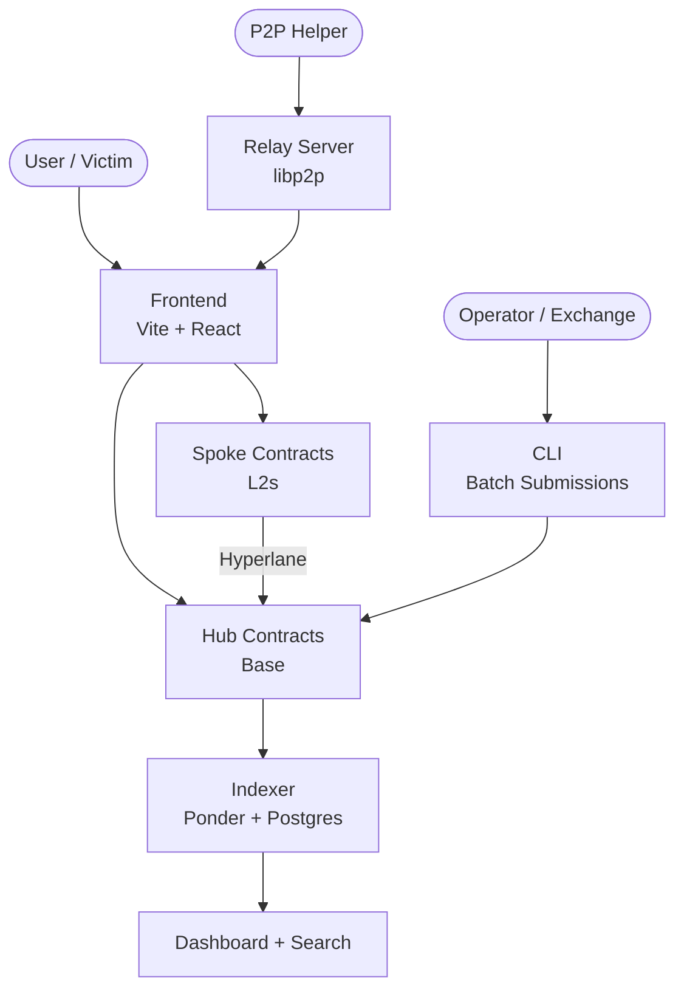

# Stolen Wallet Registry

A decentralized, cross-chain fraud registry that lets victims report stolen wallets and transactions on-chain, giving exchanges and security teams a public source of truth for fraud data.

## Architecture



## Registries

| Registry        | What's Registered             | Who Can Submit          |
| --------------- | ----------------------------- | ----------------------- |
| **Wallet**      | Stolen wallet addresses       | Individuals + operators |
| **Transaction** | Fraudulent transaction hashes | Individuals + operators |
| **Contract**    | Malicious contract addresses  | Operators only          |

## Packages

```
apps/web           Registry frontend (Vite + React 19)
apps/docs          Documentation site (Vocs)
apps/landing       Marketing site
apps/indexer       Event indexer (Ponder)
apps/relay         P2P relay server (libp2p)
packages/contracts Smart contracts (Foundry)
packages/abis      Generated contract ABIs
packages/chains    Chain configs + CAIP utilities
packages/search    Search/query library
packages/p2p       Shared P2P types + protocols
packages/cli       Operator CLI tool
packages/errors    Contract error selectors + messages
packages/caip      CAIP identifier utilities
```

## Quick Start

Three terminals to get the full hub-spoke architecture running locally with Hyperlane message passing:

```bash
pnpm install && pnpm forge:build   # Install + build contracts
pnpm anvil:crosschain              # Terminal 1 — Two Anvil chains + Hyperlane relayer
pnpm deploy:crosschain             # Terminal 2 — Deploy hub + spoke contracts
pnpm dev:crosschain                # Terminal 3 — Frontend with cross-chain features
```

Open `http://localhost:5173`. See the [Quick Start](https://stolen-wallet-registry.dev/getting-started/quick-start) guide for MetaMask setup, test accounts, and indexer instructions.

## Tech Stack

```text
Build:     Vite 7.x, TypeScript 5.9, Turborepo 2.x, pnpm
UI:        React 19, Tailwind CSS 4.x, shadcn/ui, Radix UI
Web3:      wagmi 2.x, viem 2.x, RainbowKit 2.x, TanStack Query 5.x
State:     Zustand 5.x, React Hook Form 7.x, Zod 4.x
Testing:   Vitest 4.x, Storybook 10.x, Testing Library
Contracts: Foundry, Solidity 0.8.28, OpenZeppelin
Indexer:   Ponder + Postgres
```

## Links

- [Documentation](https://stolen-wallet-registry.dev) -- Full docs
- [Hub-Spoke Architecture](https://stolen-wallet-registry.dev/concepts/hub-spoke) -- Cross-chain design
- [Operator Protocol](https://stolen-wallet-registry.dev/operator) -- Batch submissions
- [P2P Relay](https://stolen-wallet-registry.dev/p2p) -- Gasless registration

## Roadmap

| Phase | Focus                                  | Status      |
| ----- | -------------------------------------- | ----------- |
| 1     | Core registries (wallet, tx, contract) | Complete    |
| 2     | Operator CLI + batch submissions       | Complete    |
| 3     | Indexer, search, and dashboard         | Complete    |
| 4     | Cross-chain infrastructure (Hyperlane) | Complete    |
| 5     | Soulbound attestation tokens           | Complete    |
| 6     | Testnet deployment (Base/OP Sepolia)   | In Progress |
| 7     | Transaction history API (Alchemy)      | In Progress |
| 8     | Mainnet deployment                     | Planned     |
| 9     | DAO governance + operator approval     | Future      |
| 10    | Additional chain support               | Future      |

## License

MIT

---

Built with the goal of making Web3 safer for everyone.
