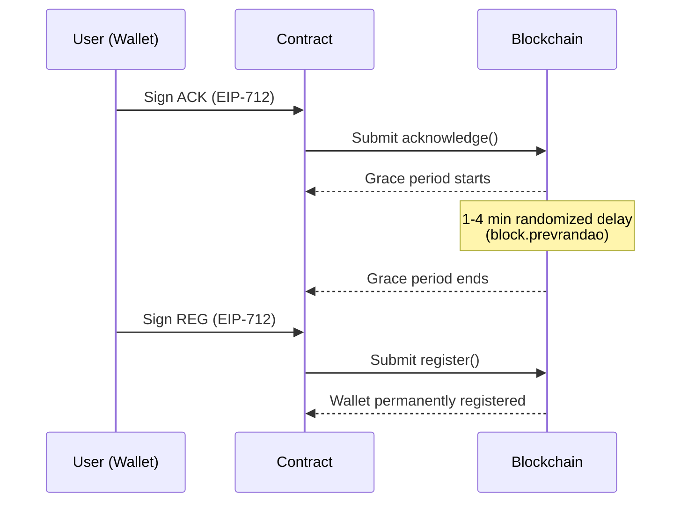

# Two-Phase Registration

SWR uses a two-phase registration model to prevent phishing attacks. An attacker who tricks a victim into signing one transaction cannot complete registration without a second, separate signature minutes later.

## Why Two Phases?

Single-transaction registration is vulnerable to social engineering. If an attacker creates a fake "security check" site that prompts a wallet signature, a single-signature model would immediately register the wallet as stolen.

Two-phase registration breaks this attack:

1. The victim would need to sign **twice**, minutes apart
2. The randomized grace period makes automation unreliable
3. The second signature request -- minutes after the first -- is inherently suspicious

## The Three Phases



### Phase 1: Acknowledgement

The user signs an EIP-712 typed message declaring their wallet stolen. The contract:

- Verifies the signature came from the wallet owner
- Validates the nonce and deadline
- Stores a pending acknowledgement with randomized timing
- Emits `WalletAcknowledged` event

### Phase 2: Grace Period

A randomized delay using `block.prevrandao` prevents timing attacks. The user cannot proceed until the grace period ends, and must complete registration before the deadline.

| Chain           | Block Time | Grace Blocks | Deadline Blocks | Grace Period | Registration Window |
| --------------- | ---------- | ------------ | --------------- | ------------ | ------------------- |
| Anvil (local)   | 13s        | 10           | 50              | ~2 min       | ~10 min             |
| Base / Optimism | 2s         | 60           | 300             | ~2 min       | ~10 min             |
| Arbitrum        | 0.25s      | 480          | 2400            | ~2 min       | ~10 min             |
| Ethereum L1     | 12s        | 10           | 50              | ~2 min       | ~10 min             |

Block counts are configured per chain to maintain consistent ~2 min grace / ~10 min window UX.

### Phase 3: Registration

The user signs a second EIP-712 message confirming permanent registration. The contract:

- Validates the stored acknowledgement (forwarder, timing, chain data)
- Verifies the second signature
- Stores the wallet entry permanently
- Deletes acknowledgement data
- Collects registration fee

## EIP-712 Typehashes

All contracts share domain name `"StolenWalletRegistry"` version `"4"`. Cross-contract replay is prevented by **distinct typehashes**, not domain separation.

### Wallet Registration

```solidity
// Acknowledgement
AcknowledgementOfRegistry(
    string statement,
    address wallet,
    address trustedForwarder,
    uint64 reportedChainId,
    uint64 incidentTimestamp,
    uint256 nonce,
    uint256 deadline
)

// Registration
Registration(
    string statement,
    address wallet,
    address trustedForwarder,
    uint64 reportedChainId,
    uint64 incidentTimestamp,
    uint256 nonce,
    uint256 deadline
)
```

### Transaction Batch Registration

```solidity
// Acknowledgement
TransactionBatchAcknowledgement(
    string statement,
    address reporter,
    address trustedForwarder,
    bytes32 dataHash,
    bytes32 reportedChainId,
    uint32 transactionCount,
    uint256 nonce,
    uint256 deadline
)

// Registration
TransactionBatchRegistration(
    string statement,
    address reporter,
    address trustedForwarder,
    bytes32 dataHash,
    bytes32 reportedChainId,
    uint32 transactionCount,
    uint256 nonce,
    uint256 deadline
)
```

The `statement` field contains a human-readable message displayed in MetaMask during signing (e.g., _"This signature acknowledges that the signing wallet is being reported as stolen..."_). It is hashed at compile time for gas efficiency.

## Nonce & Deadline Mechanics

**Nonce** -- Sequential counter per address. Prevents replay attacks. Each successful acknowledgement or registration increments the nonce. The contract rejects any submission where the nonce doesn't match the expected value.

**Deadline** -- Two distinct deadline concepts are in play:

| Deadline              | Unit              | Purpose                                                                            |
| --------------------- | ----------------- | ---------------------------------------------------------------------------------- |
| Signature deadline    | `block.timestamp` | EIP-712 signature expiry. Prevents stale signatures from being submitted.          |
| Grace period deadline | `block.number`    | Registration window. Defines when the user can start and must finish registration. |

Both include randomized jitter via `block.prevrandao` to prevent prediction.

## Registration Methods & the Forwarder Field

The `trustedForwarder` parameter in the signature determines who can submit the registration transaction and pay gas.

| Method         | `wallet`   | `trustedForwarder` | Who pays gas                     |
| -------------- | ---------- | ------------------ | -------------------------------- |
| **Standard**   | `0xVictim` | `0xVictim`         | Same wallet                      |
| **Self-relay** | `0xVictim` | `0xFunder`         | Different wallet owned by victim |
| **P2P relay**  | `0xVictim` | `0xHelper`         | Third-party helper via libp2p    |

In all cases:

- The **wallet owner** must sign both EIP-712 messages
- The `trustedForwarder` is named in the signature (cannot be changed after signing)
- Only the `trustedForwarder` can submit the `register()` transaction
- `isSponsored` is derived from `wallet != trustedForwarder`

For self-relay and P2P relay, the victim signs with their compromised wallet but someone else submits the transaction and pays gas -- critical when the wallet has been drained.
