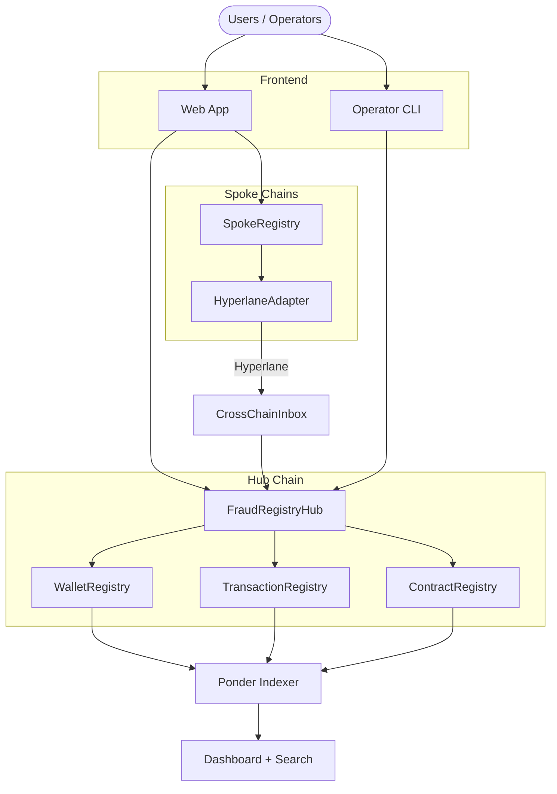

# Stolen Wallet Registry

The Stolen Wallet Registry (SWR) is a cross-chain, on-chain fraud registry. Victims of crypto theft register compromised wallets, flagged transactions, and malicious contracts -- creating a shared fraud intelligence layer that exchanges, wallets, and dApps can query.

## Why It Matters

- **Victim empowerment** -- Register a stolen wallet even if you have no funds left (relay methods cover gas)
- **Shared intelligence** -- Fraud data is public and on-chain, not siloed inside individual exchanges
- **Cross-chain** -- Registrations on any supported L2 settle to the hub chain via Hyperlane

## Three Registries

| Registry        | What gets registered                    | Who can submit          | Security model                    |
| --------------- | --------------------------------------- | ----------------------- | --------------------------------- |
| **Wallet**      | Compromised wallet addresses            | Individuals + Operators | Two-phase EIP-712 signatures      |
| **Transaction** | Fraudulent transaction hashes (batched) | Individuals + Operators | Two-phase EIP-712 + merkle proofs |
| **Contract**    | Malicious contract addresses            | Operators only          | Single-phase batch submission     |

## Three Registration Methods

| Method         | How it works                                               | Best for                             |
| -------------- | ---------------------------------------------------------- | ------------------------------------ |
| **Standard**   | Sign and pay with the wallet you are registering           | You still have temporary access      |
| **Self-Relay** | Sign with compromised wallet, pay with a different wallet  | Wallet drained, but you have another |
| **P2P Relay**  | Sign with compromised wallet, a helper pays gas via libp2p | No funds at all                      |

## Architecture

## Security Model

Every wallet and transaction registration requires **two separate signatures** with a randomized delay between them. This two-phase EIP-712 flow prevents single-transaction phishing attacks -- an attacker cannot trick a victim into registering a legitimate wallet in one step.

[Learn more about two-phase registration](/concepts/two-phase-registration)

## Explore the Docs

| Section                                           | What you will find                                        |
| ------------------------------------------------- | --------------------------------------------------------- |
| [Quick Start](/getting-started/quick-start)       | Run the app locally in under 5 minutes                    |
| [Core Concepts](/concepts/two-phase-registration) | Two-phase registration, CAIP identifiers, hub-spoke model |
| [Registries](/registries/wallet)                  | Deep dives into each registry contract                    |
| [Operator Protocol](/operator)                    | Batch submissions, economics, CLI usage                   |
| [P2P Relay](/p2p)                                 | libp2p architecture and protocol details                  |
| [Infrastructure](/infrastructure/fee-manager)     | Fee manager, soulbound tokens, indexer                    |
| [Philosophy](/philosophy/manifesto)               | Manifesto and governance model                            |
