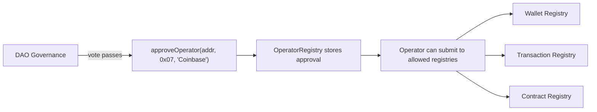

# Operator Protocol

Operators are the backbone of the registry's credibility. Without them, SWR is limited to self-attestation -- individuals reporting their own wallets as stolen. With operators, it becomes an **industry-wide fraud intelligence database**.

## What Is an Operator?

An operator is a DAO-approved entity with bulk fraud intelligence:

- **Exchanges** -- Coinbase, Kraken, Binance detect compromised accounts daily through internal monitoring
- **Security firms** -- Chainalysis, TRM Labs, Elliptic track stolen funds across chains
- **Community investigators** -- ZachXBT and similar on-chain sleuths with verified track records

The DAO votes to approve operators, granting them permission to batch-submit fraud data directly to the registry -- no two-phase signature flow required.

## Why Operators Matter

The vision:

1. Coinbase detects a compromised wallet through their internal fraud systems
2. They batch-submit it (along with hundreds of others) to SWR
3. Every other exchange, wallet, and off-ramp now knows about it -- instantly, on-chain

Individual self-attestation is important for victims. But the registry only becomes a **standard** when institutional operators are feeding it data at scale.

## OperatorRegistry Contract

The `OperatorRegistry` contract is a DAO-controlled whitelist. It stores approved operators and their permissions.

```solidity
struct Operator {
    bool approved;        // Is operator currently approved
    uint8 capabilities;   // Bitmask: 0x01=wallet, 0x02=tx, 0x04=contract
    uint64 approvedAt;    // Block number when approved
    uint64 revokedAt;     // Block number when revoked (0 if active)
    string identifier;    // Human-readable name (e.g., "Coinbase", "ZachXBT")
}
```

Operators are scoped to specific registries via a **capabilities bitmask**. An exchange might only need wallet and transaction access, while a contract auditing firm might only need contract registry access.

### Capabilities Bitmask

| Bit | Constant | Registry | Example Use |
|-----|----------|----------|-------------|
| `0x01` | `WALLET_REGISTRY` | Stolen Wallet | Exchange reporting compromised user accounts |
| `0x02` | `TX_REGISTRY` | Stolen Transaction | Tracing firms flagging fraudulent transactions |
| `0x04` | `CONTRACT_REGISTRY` | Fraudulent Contract | Security firms cataloging phishing contracts |
| `0x07` | `ALL_REGISTRIES` | All three | Full-spectrum fraud intelligence providers |

Capabilities are defined in the `RegistryCapabilities` library -- a single source of truth shared across all registry contracts:

```solidity
library RegistryCapabilities {
    uint8 internal constant WALLET_REGISTRY   = 0x01;
    uint8 internal constant TX_REGISTRY       = 0x02;
    uint8 internal constant CONTRACT_REGISTRY = 0x04;
    uint8 internal constant ALL_REGISTRIES    = 0x07;
}
```

## Key Functions

### Write Functions (DAO Only)

All write functions are `onlyOwner` -- the owner should be a DAO multisig or governance contract.

```solidity
// Approve a new operator with specified capabilities
function approveOperator(
    address operator,
    uint8 capabilities,
    string calldata identifier
) external onlyOwner;

// Revoke an operator (immediate effect)
function revokeOperator(address operator) external onlyOwner;

// Update an operator's capabilities without revoking
function updateCapabilities(
    address operator,
    uint8 capabilities
) external onlyOwner;
```

### View Functions

```solidity
// Check if address is an approved operator
function isApproved(address operator) external view returns (bool);

// Check if operator is approved for a specific registry type
function isApprovedFor(address operator, uint8 registryType) external view returns (bool);

// Get full operator data
function getOperator(address operator) external view returns (Operator memory);

// Get total count of approved operators
function approvedOperatorCount() external view returns (uint256);
```

### Events

```solidity
event OperatorApproved(address indexed operator, uint8 capabilities, string identifier, uint64 approvedAt);
event OperatorRevoked(address indexed operator, uint64 revokedAt);
event OperatorCapabilitiesUpdated(address indexed operator, uint8 oldCapabilities, uint8 newCapabilities);
```

## Approval Flow



## Hub-Only

Operators exist **only on the hub chain** (Base). There are no operator submissions from spoke chains.

Cross-chain registrations from individuals go through spoke chains via Hyperlane, but operator batch submissions are always direct to the hub. This simplifies permission management -- the DAO only needs to maintain one whitelist.

## No Two-Phase for Operators

Individual registrations require a two-phase EIP-712 flow to prevent phishing. Operators skip this entirely.

The DAO approval process **is** the trust mechanism. An entity approved by governance vote has already passed the bar that two-phase registration provides for individuals. Adding a grace period to operator batch submissions would slow down bulk intelligence sharing for no security benefit.

## Error Conditions

| Error | When |
|-------|------|
| `OperatorRegistry__ZeroAddress()` | Operator address is `address(0)` |
| `OperatorRegistry__AlreadyApproved()` | Operator is already approved |
| `OperatorRegistry__NotApproved()` | Trying to revoke/update a non-approved operator |
| `OperatorRegistry__InvalidCapabilities()` | Capabilities is `0` or exceeds `ALL_REGISTRIES` |
| `OperatorRegistry__NotAuthorizedForRegistry(uint8)` | Operator lacks required capability bit |
