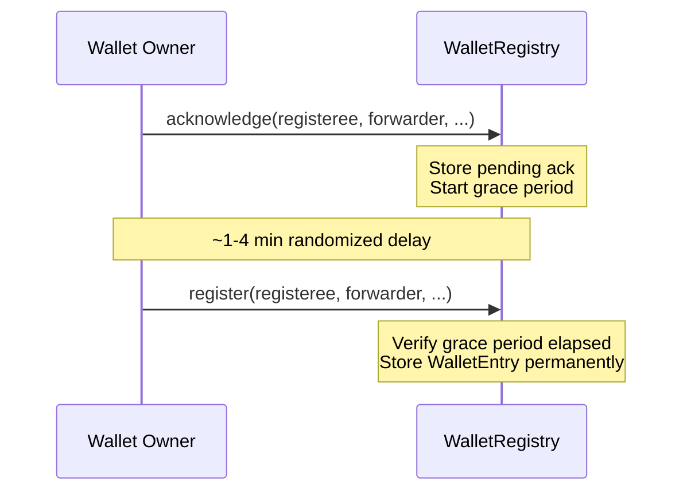

# Wallet Registry

Permanently registers stolen wallet addresses on-chain. Once registered, a wallet is marked as compromised and cannot be removed.

**Who can submit:** Individuals (self-attestation with EIP-712 signatures) and DAO-approved operators (batch submissions via OperatorSubmitter).

## Storage

```solidity
mapping(bytes32 => WalletEntry) private _wallets;
```

The storage key is derived from CAIP-10 / CAIP-363 wildcard format. For EVM wallets, the key is:

```solidity
keccak256(abi.encodePacked("eip155:_:", wallet))
```

The wildcard `_` means an EVM wallet registered on any chain is marked as compromised across **all** EVM chains. A wallet stolen on Base is also flagged on Optimism, Arbitrum, etc.

## WalletEntry

```solidity
struct WalletEntry {
    bytes32 reportedChainId;    // CAIP-2 hash of chain where incident occurred
    bytes32 sourceChainId;      // CAIP-2 hash of chain where registration was submitted
    bytes32 messageId;          // Cross-chain message ID (bytes32(0) for local)
    uint64  registeredAt;       // Block timestamp of registration
    uint64  incidentTimestamp;  // Unix timestamp of incident (0 if unknown)
    uint8   bridgeId;           // 0 = local, 1 = Hyperlane
    bool    isSponsored;        // True if someone else paid gas
}
```

## Two-Phase Registration

Every individual wallet registration goes through two phases separated by a randomized grace period. This prevents single-transaction phishing -- an attacker cannot trick a user into registering a legitimate wallet in one step.



### Phase 1: Acknowledge

```solidity
function acknowledge(
    address registeree,        // Wallet being registered
    address trustedForwarder,  // Who can call register() (can be same address)
    uint64  reportedChainId,   // Chain where incident occurred
    uint64  incidentTimestamp,  // When it happened (0 if unknown)
    uint256 deadline,          // EIP-712 signature expiry (timestamp)
    uint256 nonce,             // Replay protection
    uint8 v, bytes32 r, bytes32 s
) external;
```

- Verifies EIP-712 signature from `registeree`
- Checks wallet is not already registered or pending
- Validates nonce matches `nonces[registeree]` (reverts with `WalletRegistry__InvalidNonce` on mismatch)
- Increments nonce
- Stores `AcknowledgementData` with randomized grace period timing
- Emits `WalletAcknowledged(registeree, trustedForwarder, isSponsored)`

Anyone can submit the transaction (the forwarder is named in the signature). This is what enables relay registration methods.

### Phase 2: Register

```solidity
function register(
    address registeree,
    address trustedForwarder,  // Must match ack phase AND msg.sender
    uint64  reportedChainId,   // Must match ack phase
    uint64  incidentTimestamp,  // Must match ack phase
    uint256 deadline,
    uint256 nonce,
    uint8 v, bytes32 r, bytes32 s
) external payable;
```

- **Only** `trustedForwarder` can call this (`msg.sender` must match)
- Grace period must have elapsed (`block.number >= gracePeriodStart`)
- Must be within deadline window (`block.number < deadline`)
- Verifies second EIP-712 signature from `registeree`
- Stores `WalletEntry` permanently, deletes pending acknowledgement
- Collects fee (if FeeManager configured)
- Emits `WalletRegistered(identifier, reportedChainId, incidentTimestamp, isSponsored)`

### Dual Deadline System

Two different deadlines are in play:

| Deadline                       | Unit                          | Purpose                                               |
| ------------------------------ | ----------------------------- | ----------------------------------------------------- |
| `deadline` param               | Timestamp (`block.timestamp`) | EIP-712 signature expiry -- prevents stale signatures |
| `AcknowledgementData.deadline` | Block number (`block.number`) | Grace period window -- enforces registration timing   |

## Three Registration Methods

| Method         | Who signs  | Who pays (`trustedForwarder`) | `isSponsored` |
| -------------- | ---------- | ----------------------------- | ------------- |
| **Standard**   | registeree | registeree (same address)     | `false`       |
| **Self-Relay** | registeree | Different wallet              | `true`        |
| **P2P Relay**  | registeree | Helper (via libp2p)           | `true`        |

`isSponsored` is derived as `registeree != trustedForwarder`. The contract does not distinguish between self-relay and P2P relay -- both are "sponsored" registrations where someone else pays gas.

## Other Registration Paths

### Cross-Chain (Hub Only)

```solidity
function registerFromHub(
    bytes32 namespaceHash,
    bytes32 chainRefHash,
    bytes32 identifier,       // address as bytes32
    bytes32 reportedChainId,
    uint64  incidentTimestamp,
    bytes32 sourceChainId,
    bool    isSponsored,
    uint8   bridgeId,         // 1 = Hyperlane
    bytes32 messageId
) external onlyHub;
```

Called by `FraudRegistryHub` when a cross-chain message arrives from a `SpokeRegistry`. Silently succeeds if the wallet is already registered (no revert). Sets `bridgeId=1` and `messageId` for Hyperlane messages.

Emits both `WalletRegistered` and `CrossChainWalletRegistered`.

### Operator Batch

```solidity
function registerWalletsFromOperator(
    bytes32   operatorId,
    bytes32[] identifiers,        // Wallet addresses as bytes32
    bytes32[] reportedChainIds,
    uint64[]  incidentTimestamps
) external onlyOperatorSubmitter returns (uint256 batchId);
```

Bypasses two-phase flow entirely. Skips zero identifiers and already-registered wallets (no revert). Returns the batch ID.

Emits `WalletRegistered` per entry, then `BatchCreated` with the actual count (excluding skipped entries).

## Nonce Tracking

```solidity
mapping(address => uint256) public nonces;
```

Per-address, incremented on each successful `acknowledge()` and `register()` call. Used for EIP-712 replay protection. The nonce must be provided as a parameter and match the on-chain value -- mismatches revert with `WalletRegistry__InvalidNonce` before signature verification (fail-fast).

## Events

| Event                        | When                             | Key fields                                                                    |
| ---------------------------- | -------------------------------- | ----------------------------------------------------------------------------- |
| `WalletAcknowledged`         | Phase 1 complete                 | `registeree`, `trustedForwarder`, `isSponsored`                               |
| `WalletRegistered`           | Phase 2 / cross-chain / operator | `identifier` (bytes32), `reportedChainId`, `incidentTimestamp`, `isSponsored` |
| `CrossChainWalletRegistered` | Cross-chain only                 | `identifier`, `sourceChainId`, `bridgeId`, `messageId`                        |
| `BatchCreated`               | Operator batch                   | `batchId`, `operatorId`, `walletCount`                                        |

The `identifier` in `WalletRegistered` is `bytes32(uint256(uint160(address)))`. To recover the address: `address(uint160(uint256(identifier)))`.

## View Functions

| Function                             | Returns                                                              |
| ------------------------------------ | -------------------------------------------------------------------- |
| `isWalletRegistered(string caip10)`  | Whether wallet is registered (CAIP-10 string interface)              |
| `isWalletRegistered(address wallet)` | Whether wallet is registered (gas-efficient EVM overload)            |
| `getWalletEntry(...)`                | Full `WalletEntry` struct (both overloads)                           |
| `isWalletPending(address)`           | Whether wallet has active acknowledgement                            |
| `getDeadlines(address)`              | Grace period timing (currentBlock, expiryBlock, graceStartsAt, etc.) |
| `generateHashStruct(...)`            | EIP-712 hash struct for frontend signature generation                |
| `nonces(address)`                    | Current nonce for replay protection                                  |
